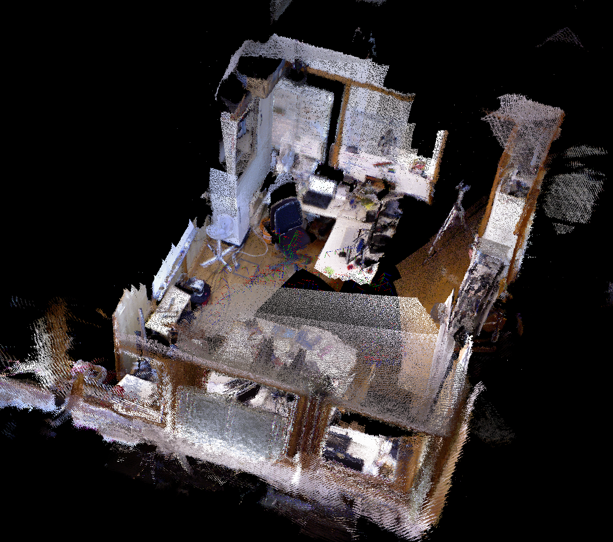
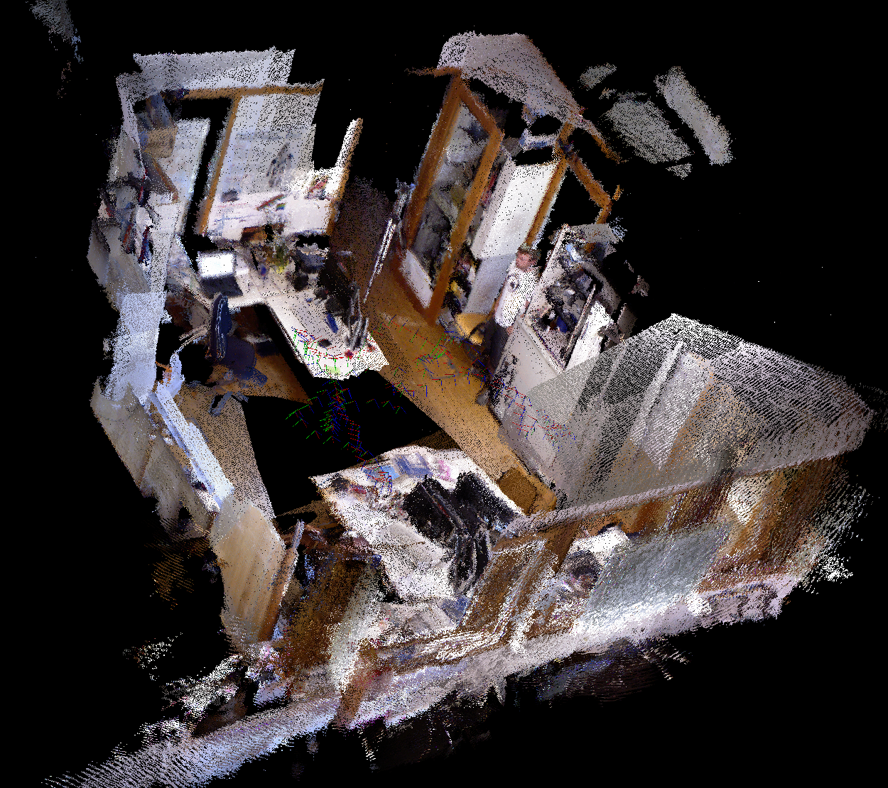
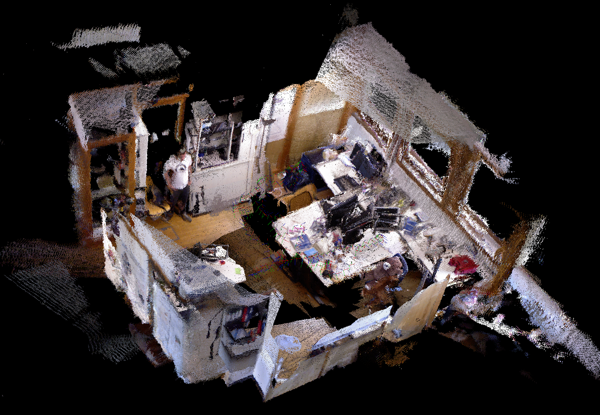
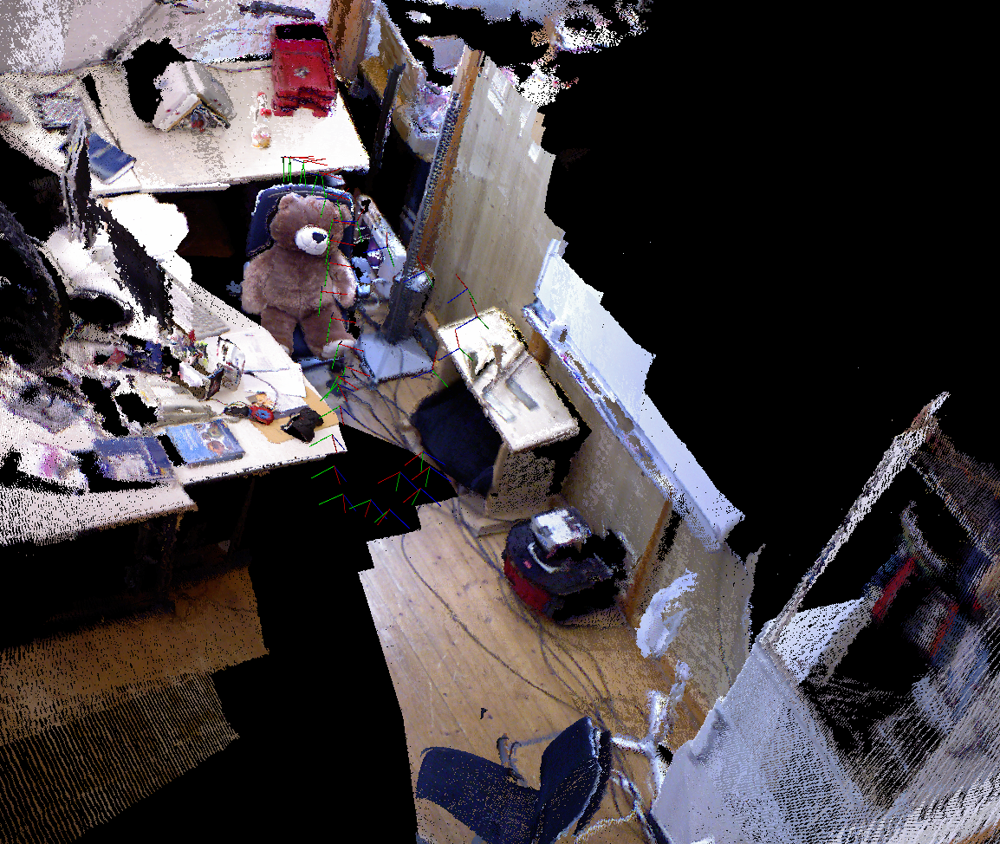
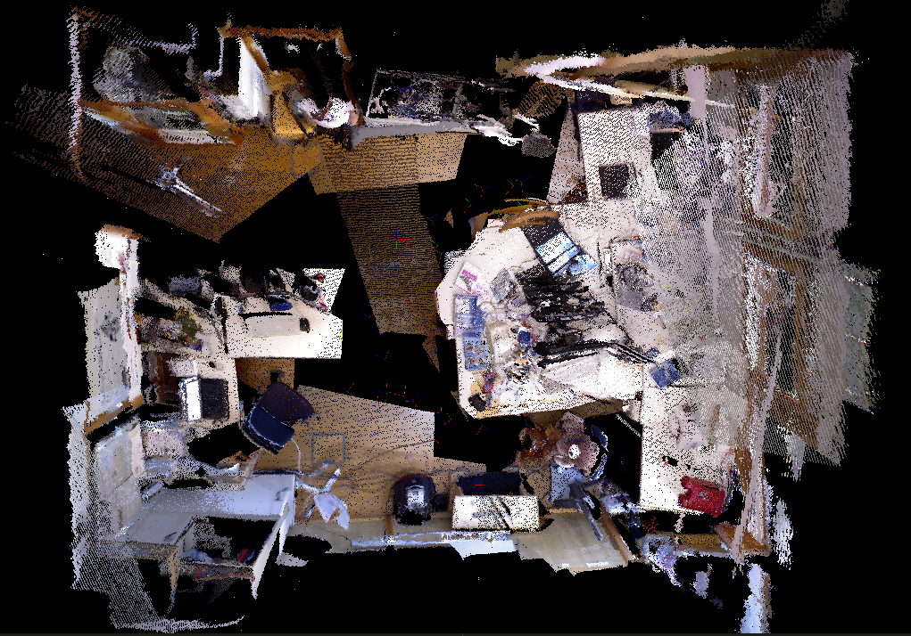
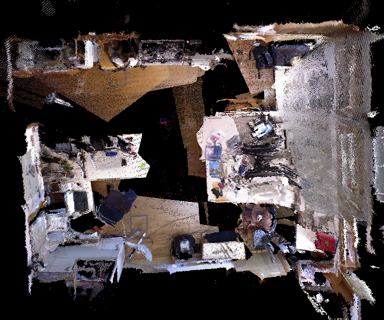

# RGBD_SLAM
Implementation of RGBD-SLAM pipeline with SIFT feature tracking, pairwise ICP and global pose-graph optimization.

Details of the implementation are documented [here](./doc/rgbd_mapping.pdf). 

## Dependencies
* OpenCV
* Point Cloud Library
* g2o
* Eigen

## Build and Run
```bash
mkdir build && cd build
cmake ..
make
```
To run the code, go download an example rgbd dataset (fr1/room for example) from the [TUM Benchmark Dataset for SLAM](https://vision.in.tum.de/data/datasets/rgbd-dataset/download) and specify the path to the data in `src/config_params.xml`, and then run the code with
```bash
cd build
./main
```
## Results
### Global reconstruction






### Local reconstruction




### Loop Closure Comparison:
Before LC:



After LC:


